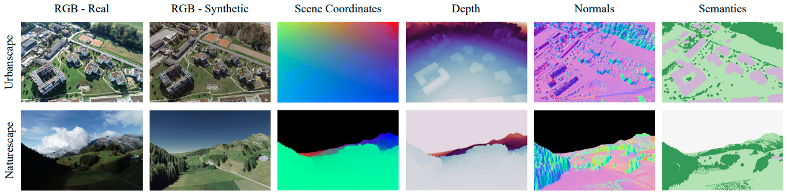
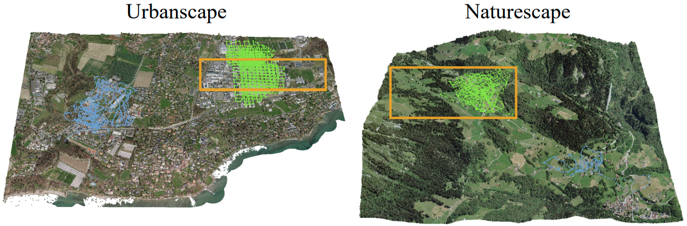
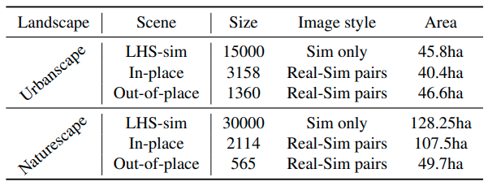

# CrossLoc Benchmark Datasets Setup

This repository contains CrossLoc Benchmark Datasets setup and splitting scripts. Please make sure you have access to the **CrossLoc Benchmark Raw Datasets** before proceeding. We present the Urbanscape and Naturescape datasets, each consiting of **multi-modal synthetic data** and **real images with accurate geo-tags** captured by drone. See below for a preview!

Ideally, you may want to use this repository as the starting template of your own project, as the python dependency, dataset and basic dataloader have already been developed. There is simply no reason to re-build the wheel. 

Happy coding! :)

<p align="center">
  
</p>

<p align="center">
  
</p>

* 3D textured models used to render the benchmark datasets. The dots and boxes denote the camera position distribution. Please check the paper for details!

The CrossLoc Benchmark datasets are officially presented in the paper
<br>
**CrossLoc: Scalable Aerial Localization Assisted by Multimodal Synthetic Data**
<br>
[Qi Yan](https://qiyan98.github.io/), [Jianhao Zheng](https://jianhao-zheng.github.io/), [Simon Reding](https://people.epfl.ch/simon.reding/?lang=en), [Shanci Li](https://people.epfl.ch/shanci.li/?lang=en), [Iordan Doytchinov](https://people.epfl.ch/iordan.doytchinov?lang=en) 
<br>
École Polytechnique Fédérale de Lausanne (EPFL)
<br>
Links: **[arXiv](https://arxiv.org/abs/2112.09081) | [code repos](https://github.com/TOPO-EPFL/CrossLoc)**


## Install dependencies

* If `conda` environment is available:

```bash
conda env create -f setup/environment.yml
conda activate crossloc
```

* Otherwise, if `conda` environment is not readily available:

```bash
python3 -m venv venvcrossloc
source venvcrossloc/bin/activate
pip3 install pip -U && pip3 install -r setup/requirements.txt
```

`open3d==0.9.0` may raise an error at some environment. You may remove the version limit to proceed.

## Setup datasets

* Setup datasets: we adopt some [DSAC*](https://github.com/vislearn/dsacstar) resources and keep its dataset convention.

```bash
cd datasets
echo $DATA_DIR # point to the CrossLoc Benchmark Raw Datasets

export OUT_DIR=$(pwd)/urbanscape
python setup_urbanscape.py --dataset_dir $DATA_DIR/urbanscape --output_dir $OUT_DIR

export OUT_DIR=$(pwd)/naturescape
python setup_naturescape.py --dataset_dir $DATA_DIR/naturescape --output_dir $OUT_DIR
```

Please note that all RGB images are linked to the `DATA_DIR` directory using symbolic link. 

* When you have the raw dataset locally preserved, please **don't move it elsewhere after setting up**. Otherwise, the symbolic links to raw RGB images don't work.
* Use `--ignore_3d_label` flag to omit 3D label generation such as coordinate, depth and normal, i.e., `python setup_urbanscape.py --dataset_dir $DATA_DIR --output_dir $OUT_DIR --ignore_3d_label`. In this case, only lightweight `calibration`, `poses`, `rgb`, and `semantics` folders will be generated (see next section for what they exactly mean).

## Dataset structure

  After setting up the dataset successfully, you would see such directory structure:

```markdown
├── test_drone_real               # drone-trajectory **in-place** real data, for testing
│   ├── calibration                 # focal length
│   ├── depth                       # (possibly) down-sampled z-buffer depth
│   ├── init                        # (possibly) down-sampled scene coordiante
│   ├── normal                      # (possibly) down-sampled surface normal
│   ├── poses                       # 4x4 homogeneous cam-to-world transformation matrix
│   ├── rgb                         # RGB image (symbolic link)
│   └── semantics                   # (possibly) full-size semantics map
├── test_drone_sim                # drone-trajectory **in-place** equivalent synthetic data, for testing
├── test_oop_drone_real           # drone-trajectory **out-of-place** real data, for testing
├── test_oop_drone_sim            # drone-trajectory **out-of-place** equivalent synthetic data, for testing
├── train_drone_real              # drone-trajectory **in-place** real data, for training
├── train_drone_sim               # drone-trajectory **in-place** equivalent synthetic data, for training
├── train_oop_drone_real          # drone-trajectory **out-of-place** real data, for training
├── train_oop_drone_sim           # drone-trajectory **out-of-place** equivalent synthetic data, for training
├── train_sim                     # LHS synthetic data, for training
├── train_sim_plus_drone_sim      # combination of LHS and drone-trajectory **in-place** synthetic data, for training
├── train_sim_plus_oop_drone_sim  # combination of LHS and drone-trajectory **out-of-place** synthetic data, for training
├── val_drone_real                # drone-trajectory **in-place** real data, for validation
├── val_drone_sim                 # drone-trajectory **in-place** equivalent synthetic data, for validation
├── val_oop_drone_real            # drone-trajectory **out-of-place** real data, for validation
├── val_oop_drone_sim             # drone-trajectory **out-of-place** equivalent synthetic data, for validation
└── val_sim                       # LHS synthetic data, for validation
```

All directories have the same sub-folders (`calibration`, `depth`, `init` and others). To make the folder tree concise, only the sub-folders in the very first directory `test_drone_sim` is shown.

## Dataset statistics

### Raw data statistics

<p align="center">
  
</p>

### Dataset splits

We randomly split the **In-place and Out-of-place** scene data into **training (40%), validation (10%) and testing (50%)** sections. As for the **LHS-sim** scene data, it is split into **training (90%) and validation (10%)** sets. We intentionally formulate a challenging visual localization task by using more real data for testing than for training to better study the real data scarcity mitigation.

## Getting started

See [`dataset_rollout.ipynb`](dataset_rollout.ipynb) to have a preview on the dataset!

See [`dataset_statistics.ipynb`](dataset_statistics.ipynb) to compute some statistics of the dataset.

## Citation

If you find our code useful for your research, please cite the paper:

````bibtex
@article{yan2021crossloc,
  title={CrossLoc: Scalable Aerial Localization Assisted by Multimodal Synthetic Data},
  author={Yan, Qi and Zheng, Jianhao and Reding, Simon and Li, Shanci and Doytchinov, Iordan},
  journal={arXiv preprint arXiv:2112.09081},
  year={2021}
}
````

